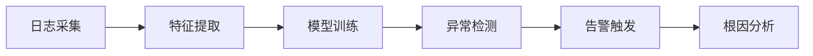

# AI-DevOps 智能运维

AI 时代下的 DevOps 演进，结合大模型能力升级传统运维体系。

---

## 目录

- [AIOps 智能运维](#aiops-智能运维)
- [AI 代码审查](#ai-代码审查)
- [ChatOps 运维助手](#chatops-运维助手)
- [智能告警降噪](#智能告警降噪)
- [AI 自动化测试](#ai-自动化测试)

---

## AIOps 智能运维

### 概述

AIOps（Artificial Intelligence for IT Operations）利用机器学习和大模型能力，实现智能化运维管理。

### 核心能力

| 能力 | 说明 | 工具 |
|------|------|------|
| 日志分析 | 异常检测、根因分析 | ELK + LLM |
| 容量预测 | 资源使用趋势预测 | Prophet / LLM |
| 故障预测 | 基于历史数据预测故障 | ML 模型 |
| 智能排障 | 自然语言查询日志 | RAG + LLM |

### 实施路径



---

## AI 代码审查

### 流程

1. 开发者提交 PR
2. AI 自动分析代码变更
3. 生成审查建议（Bug、安全、性能）
4. 人工复核

### 工具推荐

| 工具 | 说明 |
|------|------|
| GitHub Copilot | 代码补全 + 审查 |
| Claude for Business | 代码审查 |
| CodeRabbit | PR 自动审查 |
| DeepCode | 静态分析 |

---

## ChatOps 运维助手

### 核心场景

- 自然语言查询 K8s 集群状态
- 查询 Pod 日志、告警信息
- 执行简单运维操作（重启、重置）
- 团队协作与知识库问答

### 架构

```
用户（Slack/飞书）
    │
    ▼
ChatBot（GPT/Claude API）
    │
    ├──▶ K8s API（查询状态）
    ├──▶ 日志系统（ELK/Loki）
    └──▶ 知识库（RAG）
```

---

## 智能告警降噪

### 问题

传统告警风暴：大量重复告警、误报、噪音高

### 解决方案

| 方法 | 说明 |
|------|------|
| 告警聚合 | 相似告警合并为一条 |
| 根因告警 | 找出源头，只告警根因 |
| 智能收敛 | 基于历史学习自动抑制 |

### 工具

- **PagerDuty** — 告警管理
- **Grafana Alerting** — 智能告警
- **夜莺（Nightingale）** — 国产开源告警平台

---

## AI 自动化测试

### 应用场景

| 场景 | AI 能力 |
|------|---------|
| 测试用例生成 | 根据代码变更自动生成 |
| 视觉测试 | AI 识别 UI 变化 |
| 性能测试 | 异常检测 + 瓶颈分析 |
| 接口测试 | LLM 生成测试用例 |

---

## 相关资源

- [AIOps 白皮书](./AIOps白皮书.md)（待补充）
- [ChatOps 实践](./ChatOps实践.md）（待补充）

---

> 📅 更新日期：2026-05-08
> 🤖 AI 小创 整理
